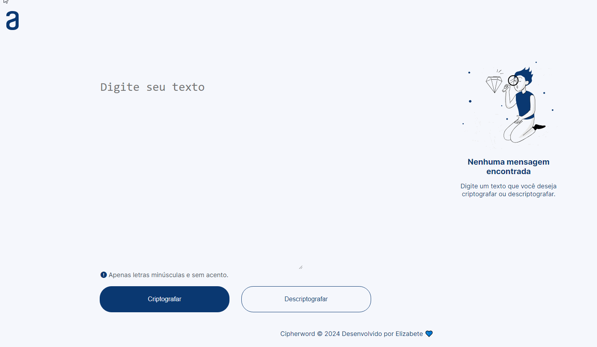

<h1>
    
    Desafio: Cipherword Decryptor
</h1>

## 📚Confira meu caderno de estudos:

## 📝 Ferramentas utilizadas no Bootcamp
- NOTION
- GIT e GITHUB
- JAVASCRIPT
- FIGMA

## ✏ Deascrição do Projeto

- A letra "e" é convertida para "enter"
- A letra "i" é convertida para "imes"
- A letra "a" é convertida para "ai"
- A letra "o" é convertida para "ober"
- A letra "u" é convertida para "ufat"

*** 
Descubra qual é a nossa mensagem secreta!
- CRIPTOGRAFADA"pairaibenterns poberr enterncairair enterssenter dentersaifimesober enter tenterr fimesnailimeszaidober enterlenter coberm sufatcenterssober!"
- DESCRIPTOGRAFADA: "parabens por encarar esse desafio e ter finalizado ele com sucesso!"
***

 

##### Desenvolvido por Elizabete Fabri 🧡 